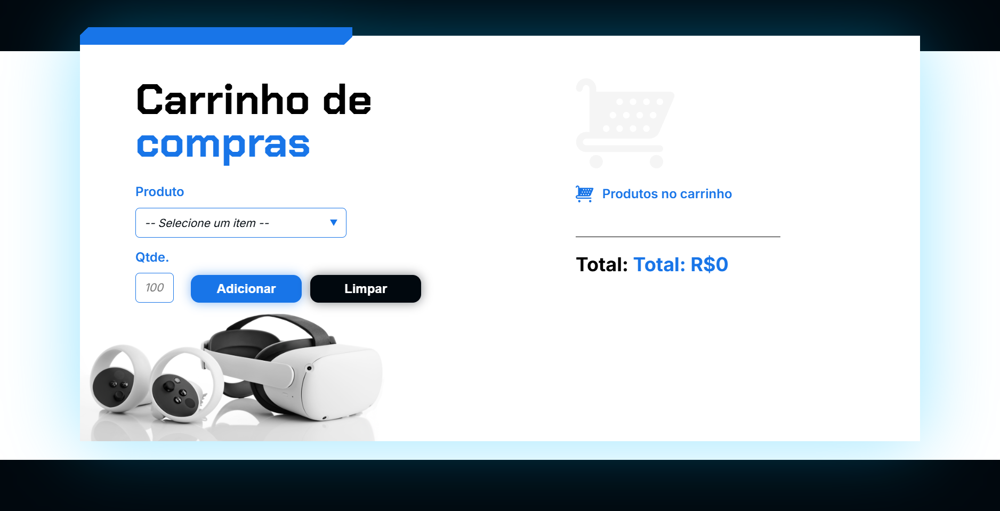

# Carrinho de Compras

Um projeto web interativo que simula um carrinho de compras, com interface moderna, responsiva e funcionalidade dinâmica para adicionar e limpar produtos.

## Menu

- [Layout](#layout)
- [Descrição](#descrição)
  - [Principais recursos incluem](#principais-recursos-incluem)
- [Tecnologias Utilizadas](#tecnologias-utilizadas)
- [Estrutura de Pastas](#estrutura-de-pastas)
  - [Arquivos Principais](#arquivos-principais)
- [Como Instalar e Rodar o Projeto](#como-instalar-e-rodar-o-projeto)
  - [Configuração](#configuração)
  - [Casos de Uso Comuns](#casos-de-uso-comuns)
  - [Solução de Problemas](#solução-de-problemas)
- [Projeto ao Vivo](#projeto-ao-vivo)
- [Licença](#licença)
- [Autor](#autor)

---

## Layout



- **Design**:
  - Gradiente com tons escuros e azul.
  - Botões interativos para adicionar e limpar produtos.
  - Responsivo para diferentes tamanhos de tela.

---

## Descrição

Este projeto é uma aplicação web simples que permite ao usuário adicionar produtos ao carrinho, visualizar o total acumulado e limpar o carrinho. Ele utiliza HTML, CSS e JavaScript para criar uma interface funcional e visualmente atraente.

### Principais recursos incluem

- **Adicionar produtos ao carrinho**: Escolha um produto, insira a quantidade e clique em "Adicionar" para incluí-lo no carrinho.
- **Limpar carrinho**: Remova todos os produtos do carrinho com um clique no botão "Limpar".
- **Cálculo dinâmico do total**: O valor total do carrinho é atualizado automaticamente conforme os produtos são adicionados ou removidos.
- **Interface responsiva**: Adapta-se a diferentes dispositivos e tamanhos de tela.

---

## Tecnologias Utilizadas

- **Front-end**:  
    
- **Fontes**: Google Fonts (Chakra Petch, Inter).

---

## Estrutura de Pastas

```plaintext
carrinho-de-compras/
├── assets/                     # Recursos visuais
│   ├── oculos.png              # Imagem de óculos
│   ├── grafismo-azul.svg       # Elemento visual azul
│   ├── carrinho-cinza.svg      # Imagem de carrinho cinza
│   ├── icone-carrinho.svg      # Ícone de carrinho
│   └── arrow-down.svg          # Ícone de seta para baixo
├── index.html                  # Página principal
├── js/                         # Scripts
│   └── app.js                  # Lógica de interação
├── style.css                   # Estilos principais
├── LICENSE                     # Licença do projeto
└── README.md                   # Documentação do projeto
```

### Arquivos Principais

- `index.html`: Estrutura da página com o formulário e o carrinho de compras.
- `app.js`: Funções adicionar() e limpar() para gerenciar os produtos no carrinho.
- `style.css`: Estilos principais, incluindo gradientes, responsividade e design moderno.

---

## Como Instalar e Rodar o Projeto

### Configuração

1. Clone o repositório:

```bash
git clone https://github.com/Melksedeque/carrinho-de-compras.git
```

2. Abra o arquivo index.html no navegador.

### Casos de Uso Comuns

1. Adicionar produtos: Selecione um produto, insira a quantidade e clique em "Adicionar".
2. Limpar carrinho: Clique no botão "Limpar" para remover todos os produtos do carrinho.

### Solução de Problemas

- **Botão "Adicionar" não funciona:** Verifique se o arquivo `app.js` está corretamente referenciado no `index.html`.
- **Estilos quebrados:** Certifique-se de que o arquivo style.css está no caminho correto.

---

## Projeto ao Vivo

Você pode ver o projeto ao vivo neste link: [https://melksedeque.github.io/carrinho-de-compras/](https://melksedeque.github.io/carrinho-de-compras/)

---

## Licença

Este projeto está licenciado sob a Licença MIT. Veja o arquivo [LICENSE](https://github.com/Melksedeque/carrinho-de-compras?tab=MIT-1-ov-file) para mais detalhes.

---

## Autor

- GitHub - [Melksedeque Silva](https://github.com/Melksedeque/)
- FrontEndMentor - [@Melksedeque](https://www.frontendmentor.io/profile/Melksedeque)
- Twitter / X - [@SouzaMelk](https://x.com/SouzaMelk)
- LinkedIn - [Melksedeque Silva](https://www.linkedin.com/in/melksedeque-silva/)
